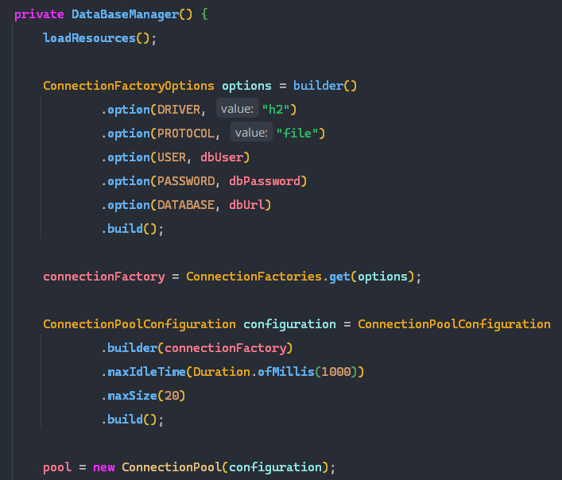
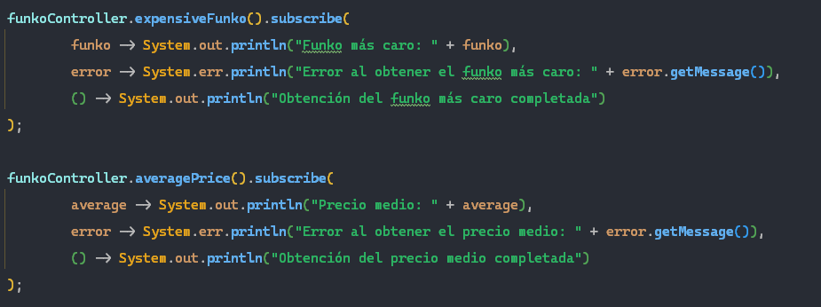

# Funkos Reactivos

## Autores

- Jaime Medina
- Eva Gómez Uceda

## Arquitectura seguida en el código.

La arquitectura se ha dividido por partes:  
En la carpeta `models` contamos con el apartado de datos, como la clase Funkos , IdGenerator o Notificacion. La parte de lógica se encuentra en las carpetas `repositories` y `services`, en las que contamos con clases como **FunkoRepositoryImpl**,  **FunkoServiceImpl** o **DataBaseManager**. Todas estas se encargan de la parte lógica del programa. Tambien contamos con carpetas como `routes` o `exceptions`, estas contienen las rutas y las excepciones usadas en el programa. En **FunkoStorage** tenemos los métodos correspondientes para importar desde CSV y exportar a JSON. Por último tenemos **FunkoController** que llama a los métodos de FunkoService.

## DataBase

En la clase DataBaseManager usamos el driver **R2DBC** para conectarnos a la base de datos H2. Para ello usamos **ConnectionFactory**, **ConnectionFactoryOptions** en el que establecemos las opciones de conexión y **ConnectionPoolConfiguration**. Todo esto lo usamos de la siguiente forma:

También tenemos el método loadResources que se encarga de leer del fichero de propiedades database.properties la URL, el  
usuario, la contraseña y si debemos o no de iniciarlizar las tablas. Para esto haremos uso del método startTables que  
llamará al método `executeScripts` y este ejecutará las sentencias SQL de los ficheros *delete.sql* e *init.sql*.

## FunkosService

Esta clase implementa la interfaz FunkosService, que contiene los siguientes métodos:

- `findAll()`: Devuelve una secuencia de Funkos a través de un flujo (Flux).

- `findByNombre(String nombre)`: Busca Funkos por nombre y devuelve un flujo. Si no se encuentra ninguno, lanza una  
  excepción `FunkoNotFoundException`.

- `findById(long id)`: Busca un Funko por su ID y devuelve un Mono. Si no se encuentra, lanza una  
  excepción `FunkoNotFoundException`.

- `save(Funko funko)`: Guarda un Funko en el repositorio y notifica una nueva notificación de tipo "NEW".

- `update(Funko funko)`: Actualiza un Funko en el repositorio y notifica una notificación de tipo "UPDATED".

- `deleteById(long id)`: Elimina un Funko por su ID en el repositorio y notifica una notificación de tipo "DELETED".

- `deleteAll()`: Elimina todos los Funkos en el repositorio y borra la caché.
- `exportToJson()`: Llama al método `exportToJson` de la clase **FunkoStorage**
  - `importFromCsv()`: Llama al método `loadCsv` de la clase **FunkoStorage**.  
    Todos estos métodos llaman llaman a los métodos de **FunkoRepository** e implementan notificaciones, esto se hace  
    gracias a la clase **FunkosNotifications** y su método notify.

## FunkosNotifications

**Clase: FunkosNotificationsImpl**

La clase `FunkosNotificationsImpl` es una implementación de la interfaz `FunkosNotifications`, diseñada para gestionar  
notificaciones relacionadas con Funkos. Estos son sus métodos:

- `getInstance()`: Proporciona una instancia única de `FunkosNotificationsImpl` para garantizar la singularidad de la  
  notificación.

- `getNotificationAsFlux()`: Devuelve un flujo (Flux) de notificaciones de Funkos, permitiendo a otros componentes  
  suscribirse y recibir notificaciones.

- `notify(Notificacion<Funko> notificacion)`: Permite enviar notificaciones de Funkos a través del flujo, que serán  
  recibidas por los suscriptores.

Esta clase se encarga de la gestión de notificaciones relacionadas con Funkos, ofreciendo una forma de suscribirse y  
recibir notificaciones a medida que ocurren.

## FunkoRepository

La clase `FunkoRepositoryImpl` implementa la interfaz `FunkoRepository` que a su vez implementa la  
interfaz `CrudRepository`. Se encarga de interactuar con una base de datos para realizar operaciones CRUD relacionadas  
con los Funkos. Estos son sus métodos

- `save(Funko funko)`: Inserta un Funko en la base de datos y devuelve un Mono con el Funko insertado.

- `update(Funko funko)`: Actualiza un Funko en la base de datos y devuelve un Mono con el Funko actualizado.

- `findById(Long id)`: Busca un Funko por su ID en la base de datos y devuelve un Mono con el Funko encontrado.

- `findAll()`: Busca y devuelve todos los Funkos en la base de datos como un flujo (Flux).

- `deleteById(Long idDelete)`: Borra un Funko por su ID en la base de datos y devuelve un Mono booleano que indica si se  
  realizó la eliminación con éxito.

- `deleteAll()`: Borra todos los Funkos en la base de datos y devuelve un Mono vacío.

- `findByNombre(String nombre)`: Busca Funkos por nombre en la base de datos y los devuelve como un flujo (Flux).

- `exportJson(String ruta)`: Exporta los Funkos a un archivo JSON en la ruta especificada.

La forma de obtener datos de la Base de Datos es sencilla, vamos a explicar el método findAll.  
El método devuelve un Flux de Funkos, para ello usamos Flux.usingWhen que garantiza la apertura y cerrado de conexión  
correctos, abrimos la conexión con connectionFactory.create() y ejecutamos la query con connection.createStatement(  
*Sentencia SQL*). Después, con flatMap procesamos los datos que nos devuelve la base de datos y creamos funkos con el  
patrón builder. Al acabar cerramos la conexión con Connection::close

## FunkoController

La clase `FunkoController` se encarga cargar los Funkos desde el CSV y de realizar operaciones de búsqueda.

- **Entrada de datos**:
  - `loadCsv()`: lee el CSV y crea objetos Funko para agregarlos a una Lista, para ello utiliza el método `loadCsv()`.
- **Métodos de obtención de datos**:  
  Para obtener los datos utilizamos los métodos de stream, como por ejemplo filter o collect.
  - `expensiveFunko()`: Devuelve el Funko más caro en la colección.
  - `averagePrice()`: Calcula el precio promedio de los Funkos en la colección.
  - `groupByModelo()`: Agrupa los Funkos por modelo.
  - `funkosByModelo()`: Cuenta la cantidad de Funkos por modelo.
  - `funkosIn2023()`: Filtra los Funkos lanzados en el año 2023.
  - `numberStitch()`: Cuenta la cantidad de Funkos cuyo nombre contiene "Stitch".
  - `funkoStitch()`: Filtra y devuelve los Funkos cuyo nombre contiene "Stitch".

## Ejecución

En la clase Main primero instanciamos todos los objetos llamando a sus métodos getInstance(). Posteriormente llamamos al método `getNotificationAsFlux` de **FunkosNotificationImpl** y nos subscribimos, de esta forma iniciamos el servicio de  
notificaciones lo primero y ahora nos irán saltando a medidas que recibamos notificaciones. Dependiendo del tipo de notificación (NEW, UPDATED, DELETED) imprimiremos un mensaje distinto, y en caso de error lo mostraremos con  
System.err.println.

Después llamamos al método loadCsv de la clase FunkoController para que lea los funkos del csv y los cargue en memoria. Posteriormente llamaremos a los métodos de obtención de datos como expensiveFunko y nos subscribiremos.

Para introducir los datos en la base de datos usaremos el método save de **FunkosService** y lo haremos dentro de un bucle for-each. Después ya podemos llamar a los métodos de esta clase como `findById` o `findByNombre` y subscribirnos.  
Para terminar exportaremos los funkos a un Json con exportJson y le pasaremos por parámetro la ruta con la clase **Routes**.  
Para finalizar el programa usaremos *System.exit(0)* que provocará la salida inmediata.